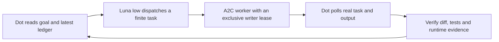

# ChatGPT Dot goal and agent management

A2C v0.4.0 supports an existing ChatGPT Dot supervisor managing a continuing
product goal through bounded, auditable worker tasks. Dot owns prioritization,
task difficulty, acceptance and selection of the next task. It stays read-only
in the product source tree. A2C owns authorized local execution, exact workspace
routing, provider/session binding and durable receipts.

## Existing loop

Luna is a dispatcher, not the reviewer or long-running supervisor. Its turn
ending does not prove the worker ended. Dot must read the real child task and
session. Native terminal-event subscription was not verified in the recorded
installation; the demonstrated supervision mechanism is the existing timer
and direct task/session polling. A2C does not install a new cloud scheduler or
protected continuation to maintain this loop.

The existing finite `orchestrator_run_*` and `orchestrator_audit_*` APIs offer
durable plans, explicit pause/resume, audit claims and PASS/REWORK/BLOCKED
decisions. Each step resolves against its agent's live catalog at admission
and dispatch. They complement the supervisor; they do not independently invent
or authorize an unlimited product backlog.

## Worker selection

- Simple GLM tasks explicitly select START; normal GLM tasks explicitly select
  INDIVIDUAL. Read back the exact session's requested and observed entitlement.
  DEFAULT is not evidence of either plan.
- Require the target model/family's highest live effort for GLM and Gemini.
  The recorded account advertised GLM max and Gemini high. Query again for each
  dispatch; these values are observations, not a permanent catalog.
- Antigravity Opus 5.5 is a user-authorized UI specialist and difficult-task
  dispatch alternative alongside Astra/xhigh. This is a routing preference,
  not a measured assertion of equal model capability. Opus admission freshly
  checks the official AGY catalog and requires the highest advertised effort.
- Verify requested, dispatched and observed values separately. Antigravity
  evidence comes from its own process protocol, exact conversation's initial
  settings, or a log line correlated to that conversation. A recent unrelated
  CLI log is not model evidence. Unknown stays unknown; no silent fallback.

The account's live catalog and actual inference admission remain separate.
Quota exhaustion reports its real pool/retry timing. Preserve partial work,
verify it and form a new finite task when appropriate; do not replay the old
task or automatically switch model/provider to make a failed receipt green.

## Resume safely

Use an explicit human request to resume the saved loop. Read the current ledger,
checkpoint, git status, queue and writer. Existing work is supervised using the
same task/session ID; uncertain submission uses read-after-error, not duplicate
create. A single shared worktree has at most one writing worker.

See [the finite recovery entry](engineering-ai-workflow.md) for the local gate.
Its status/start commands do not launch a product task, silently clear a pause,
or assert that the remote Dot session is alive. Durable workflow instructions
are operational references, not authorization credentials.

Account login/2FA, cloud thread partial-create/permission review, revoked access,
external network outages and provider quota are outside A2C's local self-repair
boundary. No review or authorization mechanism is disabled to recover them.
